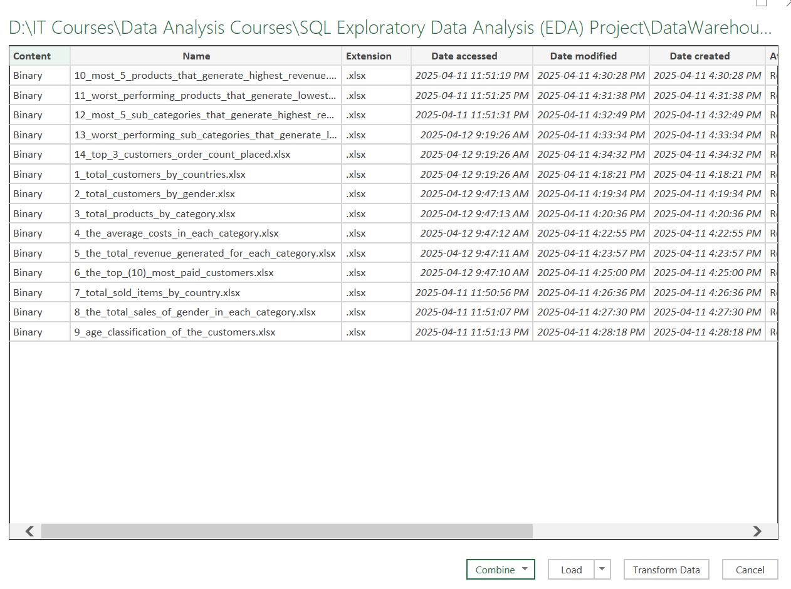

# **DataWarehouse DWH Exploratory Data Analysis (EDA) Project**

## **1. Introduction:**
This project focuses on conducting **Exploratory Data Analysis (EDA) on the "DataWarehouse" DWH**, specifically targeting the gold layer views within the Medallion architecture. These views, created as part of the "Data Warehouse SQL Project - Unlocking Data-Driven Insights" (available on GitHub: https://github.com/Geoshy/Data_Warehouse_SQL_Project), represent the final, **business-ready data for consumption**. The EDA will involve querying these gold layer views to uncover valuable insights and analyze the data. Measures analysis includes **identifying the top-selling products, categories, and subcategories, discovering the highest-paying and most frequent customers, exploring customer demographics and age distributions, determining the top-performing countries in terms of sales and revenue, and identifying the least successful products in terms of total sales**. The findings will be consolidated into **comprehensive dashboards** to provide a contextual view of these insights.

## **2. Tools I Used:**
**1. SQL:** allowing me to query the database and explore critical insights.

**2. SQL Server Management Studio (SSMS):** RDBMS for managing and interacting with database DWH.

**3. Visual Studio Code:** for database management and executing SQL queries.

**4. Excel & Power Query Editor:** to create charts of the critical insights that are explored from the analysis.

**5. Git & GitHub:** for sharing my SQL scripts and analysis.

## **3. Exploratory Data Analysis (EDA) SQL Script:**

### **3.1. Database Exploration:**

**The target database DWH "DataWarehouse"** is represented in the **gold layer** views of the Medallion architecture of the data warehouse that I created in the project "Data Warehouse SQL Project - Unlocking Data-Driven Insights", which is the final **business-ready data for consumption**:

- **Project Name:** ***"Data Warehouse SQL Project - Unlocking Data-Driven Insights"***   
- **GitHub Link:** https://github.com/Geoshy/Data_Warehouse_SQL_Project

So, in the exploratory data analysis **(EDA)** project of the (DataWarehouse) I will query the gold layer views to explore and analyze the data:

```sql
-- Explore All Object in the Database (DataWarehouse):
SELECT * FROM INFORMATION_SCHEMA.TABLES
WHERE TABLE_SCHEMA = 'gold';

-- Explore All Columns in the Database (DataWarehouse):
SELECT * FROM INFORMATION_SCHEMA.COLUMNS
WHERE TABLE_SCHEMA = 'gold';

-- Explore All Columns in the Database (DataWarehouse) of Table (dim_products):
SELECT *
FROM INFORMATION_SCHEMA.COLUMNS
WHERE
    TABLE_SCHEMA = 'gold'
    AND
    TABLE_NAME = 'dim_products'; -- 11 Columns

-- Explore All Columns in the Database (DataWarehouse) of Table (dim_customers):
SELECT *
FROM INFORMATION_SCHEMA.COLUMNS
WHERE
    TABLE_SCHEMA = 'gold'
    AND
    TABLE_NAME = 'dim_customers'; -- 10 Columns

-- Explore All Columns in the Database (DataWarehouse) of Table (fact_sales_details):
SELECT *
FROM INFORMATION_SCHEMA.COLUMNS
WHERE
    TABLE_SCHEMA = 'gold'
    AND
    TABLE_NAME = 'dim_products'; -- 11 Columns
```
### **3.2. Dimensions Exploration:**
Indentifying the **unique values (or categories)** in each dimension, it help us recognizing how might be grouped or segmented which is useful later for analysis.
```sql
-- First Dimension Table "dim_customers":
-- (1) Explore Column "country":
SELECT DISTINCT country
FROM gold.dim_customers;
-- USA
-- N/A
-- Germany
-- Australia
-- United Kingdom
-- Canada
-- France

-- (2) Explore Column "marital_status":
SELECT DISTINCT marital_status
FROM gold.dim_customers;
-- Single
-- Married

-- Column "marital_status" dose not contain null values:
SELECT * 
FROM gold.dim_customers
WHERE marital_status IS NULL; -- 0

-- (3) Explore Column "gender":
SELECT DISTINCT gender
FROM gold.dim_customers;
-- N/A
-- Male
-- Female

-- Second Dimension Table "dim_products":
-- (1) Explore Column "category":
SELECT DISTINCT category 
FROM gold.dim_products;
-- NULL
-- Accessories
-- Bikes
-- Clothing
-- Components

-- There is not matched 7 rows when join product related table in data warehouse foundation:
SELECT * FROM gold.dim_products WHERE category IS NULL; -- 7

-- (2) Explore Column "sub_category":
SELECT DISTINCT sub_category
FROM gold.dim_products; -- 37
-- NULL
-- Bib-Shorts
-- Bike Racks
-- Bike Stands
-- Bottles and Cages
-- Bottom Brackets
-- Brakes
-- Caps
-- Chains
-- Cleaners
-- Cranksets
-- Derailleurs
-- Fenders
-- Forks
-- Gloves
-- Handlebars
-- Headsets
-- Helmets
-- Hydration Packs
-- Jerseys
-- Lights
-- Locks
-- Mountain Bikes
-- Mountain Frames
-- Panniers
-- Pumps
-- Road Bikes
-- Road Frames
-- Saddles
-- Shorts
-- Socks
-- Tights
-- Tires and Tubes
-- Touring Bikes
-- Touring Frames
-- Vests
-- Wheels

SELECT * FROM gold.dim_products WHERE sub_category IS NULL; -- 7
    
-- (3) Explore Column "maintenance":
SELECT DISTINCT maintenance
FROM gold.dim_products;
-- NULL
-- No
-- Yes
SELECT * FROM gold.dim_products WHERE maintenance IS NULL; -- 7

-- (4) Explore Column "product_line":
SELECT DISTINCT product_line
FROM gold.dim_products;
-- Mountain
-- N/A
-- Other Sales
-- Road
-- Touring

-- Explore the whole hierarchy of our products:
SELECT
    category,
    sub_category,
    product_name,
    product_line
FROM
    gold.dim_products
ORDER BY
    1,2,3,4;
```
### **3.3. Date Exploration:**
Indentify the **earliest and the latest dates** (date boundaries), which help to understand the scope of the data and **timespan**, for the target time analysis.
```sql
-- Explore the date of the first and last order:
-- Explore how many years of sales available in the database:
SELECT
    MIN(order_date) AS first_order_date,
    MAX(order_date) AS last_order_date,
    DATEDIFF(YEAR, MIN(order_date), MAX(order_date)) AS order_range_years,
    DATEDIFF(MONTH, MIN(order_date), MAX(order_date)) AS order_range_months
FROM  
    gold.fact_sales_details;

-- Explore the youngest and the oldest customer with their ages:
SELECT
    MIN(birthdate) AS oldest_birthdate,
    DATEDIFF(YEAR, MIN(birthdate), GETDATE()) AS age_of_oldest_customer,
    MAX(birthdate) AS youngest_birthdate,
    DATEDIFF(YEAR, MAX(birthdate), GETDATE()) AS age_of_youngest_customer
FROM
    gold.dim_customers;

SELECT
    customer_key,
    customer_id,
    CONCAT(first_name, ' ', last_name) AS full_name,
    birthdate,
    DATEDIFF(YEAR, birthdate, GETDATE()) AS age
FROM
    gold.dim_customers
WHERE
    birthdate = (SELECT MIN(birthdate) FROM gold.dim_customers)
    OR
    birthdate = (SELECT MAX(birthdate) FROM gold.dim_customers)
ORDER BY
    birthdate ASC,
    CONCAT(first_name, ' ', last_name) ASC;
```
### **3.4. Measures Exploration:**
Calculate the **key metric of the business (big numbers)**, to find the highest and lowest level of aggregation.

**3.4.1. Find The Total Sales:** 
```sql
SELECT SUM(sales_amount) AS total_sales
FROM gold.fact_sales_details; -- 29356250.00

-- Find the total sales with money format:
-- First way:
SELECT FORMAT((SUM(sales_amount)), 'N2') AS total_sales
FROM gold.fact_sales_details; -- 29,356,250.00

-- Second way:
SELECT CONVERT(NVARCHAR, CAST(SUM(sales_amount) AS MONEY), 1) AS total_sales
FROM gold.fact_sales_details; -- 29,356,250.00
```

**3.4.2. Explore How Many Items are Sold:** 
```sql
SELECT SUM(quantity) AS total_quantity 
FROM gold.fact_sales_details; -- 60423
```
**3.4.3. Find The Average Selling Price:** 
```sql
SELECT ROUND(AVG(price), 0) AS average_selling_price
FROM gold.fact_sales_details; -- 486.000000
```
**3.4.4. Find The Median of Selling Price:** 
```sql
SELECT
    CASE
        when COUNT(*) % 2 = 0 THEN 'Even Number'
        ELSE 'Uneven Number'
    END AS number_type_check
FROM gold.fact_sales_details; -- Even Number

WITH fact_cte AS (
    SELECT
        *,
        ROW_NUMBER() OVER(ORDER BY price ASC) AS price_ranking,
        COUNT(*) OVER() AS price_count
    FROM gold.fact_sales_details
)
SELECT
    ROUND(AVG(DISTINCT price), 0) AS median_selling_price
FROM
    fact_cte
WHERE
    price = (SELECT price FROM fact_cte WHERE price_ranking = (price_count / 2))
    OR
    price = (SELECT price FROM fact_cte WHERE price_ranking = ((price_count + 2)) / 2); -- 30.000000
```
```sql
-- Create a median_price_view to be easy import the median value in measures key metrics report:
CREATE VIEW median_price_view AS
WITH fact_cte AS (
    SELECT
        *,
        ROW_NUMBER() OVER(ORDER BY price ASC) AS price_ranking,
        COUNT(*) OVER() AS price_count
    FROM gold.fact_sales_details
)
SELECT
    ROUND(AVG(DISTINCT price), 0) AS median_selling_price
FROM
    fact_cte
WHERE
    price = (SELECT price FROM fact_cte WHERE price_ranking = (price_count / 2))
    OR
    price = (SELECT price FROM fact_cte WHERE price_ranking = ((price_count + 2)) / 2); 
```
**3.4.5. Find The Mode of Selling Price:** 
```sql
SELECT
    TOP 1 price AS mode_selling_price
FROM (
    SELECT
        price,
        COUNT(*) AS price_frequency
    FROM
        gold.fact_sales_details
    GROUP BY
        price
) AS mode_subquery
ORDER BY
    price_frequency DESC; -- 5.00
```

```sql
-- Create a mode_price_view to be easy import the mode value in measures key metrics report:
CREATE VIEW mode_price_view AS 
SELECT
    TOP 1 price AS mode_selling_price
FROM (
    SELECT
        price,
        COUNT(*) AS price_frequency
    FROM
        gold.fact_sales_details
    GROUP BY
        price
) AS mode_subquery
ORDER BY
    price_frequency DESC;
```
**3.4.6. Find The Total Number Of Orders:** 
```sql
SELECT COUNT(DISTINCT(order_number)) AS orders_count
FROM gold.fact_sales_details; -- 27659
```
**3.4.7. Find The Total Number Of Products::** 
```sql
SELECT COUNT(DISTINCT(product_id)) AS products_count
FROM gold.dim_products; -- 295
```
**3.4.8. Find The Total Number Of Customers::** 
```sql
SELECT COUNT(customer_id) AS customers_count
FROM gold.dim_customers; -- 18484
```
**3.4.9. Find The Total Number Of Customers That Has Placed an Order:**
```sql
SELECT
    COUNT(customer_key) AS customer_order_count, -- 60398 (Not Make Sense)
    COUNT(DISTINCT customer_key) AS distinct_customer_count -- 18484 (Make Sense) 
FROM
    gold.fact_sales_details; 
```
### **3.5. Measures Key Metrics Report Exploration:**
It is very useful for analysis to put all measures key metrics in **one referenced report**, the report contain:

    (1) The total sales key metric.
    (2) How many items are sold key metric.
    (3) The average selling price key metric.
    (4) The median selling price key metric.
    (5) The mode selling price key metric.
    (6) The total number of orders.
    (7) The total number of customers.
    (8) The total number of products.
    (9) The total number of customers that has placed an order.

**3.5.1 Create Referenced Measures Key Metrics Report:**
```sql
SELECT 'Total Sales' AS measure_name, FORMAT((SUM(sales_amount)), 'N2') AS measure_value FROM gold.fact_sales_details
UNION ALL
SELECT 'Total Quantity' AS measure_name, CAST(SUM(quantity) AS NVARCHAR) AS measure_value FROM gold.fact_sales_details
UNION ALL
SELECT 'Average Price' AS measure_name, CAST(ROUND(AVG(price), 0) AS NVARCHAR) AS measure_value FROM gold.fact_sales_details
UNION ALL
SELECT 'Median Price' AS measure_name, CAST(median_selling_price AS NVARCHAR) AS measure_value FROM median_price_view
UNION ALL 
SELECT 'Mode Price' AS measure_name, CAST(mode_selling_price AS NVARCHAR) AS measure_value FROM mode_price_view
UNION ALL
SELECT 'Total Orders Count' AS measure_name, CAST(COUNT(DISTINCT(order_number)) AS NVARCHAR) AS measure_value FROM gold.fact_sales_details
UNION ALL 
SELECT 'Total Products Count' AS measure_name, CAST(COUNT(DISTINCT(product_id)) AS NVARCHAR) AS measure_value FROM gold.dim_products
UNION ALL
SELECT 'Total Customers Count' AS measure_name, CAST(COUNT((customer_id)) AS NVARCHAR) AS measure_value FROM gold.dim_customers;
```
**3.5.2 Create Referenced Measures Key Metrics Report Stored Procedure "measures_key_metrics_sp":**

Create a **Stored Procedure** for a **full measures key metrics report** is very useful as the code can be reused over and over again (like a function in programming) when call to execute, which leads to **high performance and security**.

AS, when you call a stored procedure for the first time, SQL Server creates an **execution plan and stores it in the cache**. In the **subsequent executions**, SQL Server reuses the plan to execute the stored procedure **very fast with reliable performance**.
```sql
CREATE OR ALTER PROCEDURE measures_key_metrics_sp AS
BEGIN
    DECLARE @sp_start_time DATETIME, @sp_end_time DATETIME;
    BEGIN TRY
    
        SET @sp_start_time = GETDATE();
        SELECT 'Total Sales' AS measure_name, FORMAT((SUM(sales_amount)), 'N2') AS measure_value FROM gold.fact_sales_details
        UNION ALL
        SELECT 'Total Quantity' AS measure_name, CAST(SUM(quantity) AS NVARCHAR) AS measure_value FROM gold.fact_sales_details
        UNION ALL
        SELECT 'Average Price' AS measure_name, CAST(ROUND(AVG(price), 0) AS NVARCHAR) AS measure_value FROM gold.fact_sales_details
        UNION ALL
        SELECT 'Median Price' AS measure_name, CAST(median_selling_price AS NVARCHAR) AS measure_value FROM median_price_view
        UNION ALL 
        SELECT 'Mode Price' AS measure_name, CAST(mode_selling_price AS NVARCHAR) AS measure_value FROM mode_price_view
        UNION ALL
        SELECT 'Total Orders Count' AS measure_name, CAST(COUNT(DISTINCT(order_number)) AS NVARCHAR) AS measure_value FROM gold.fact_sales_details
        UNION ALL 
        SELECT 'Total Products Count' AS measure_name, CAST(COUNT(DISTINCT(product_id)) AS NVARCHAR) AS measure_value FROM gold.dim_products
        UNION ALL
        SELECT 'Total Customers Count' AS measure_name, CAST(COUNT((customer_id)) AS NVARCHAR(20)) AS measure_value FROM gold.dim_customers;    

        SET @sp_end_time = GETDATE();
        PRINT('-----------------------------');
        PRINT('Total Strored Procedure Load Duration = ' + CAST((DATEDIFF(SECOND, @sp_start_time, @sp_end_time)) AS NVARCHAR))
        PRINT('-----------------------------');

    END TRY

    BEGIN CATCH
        PRINT('Error Message: ' + ERROR_MESSAGE());
		PRINT('Error Line: ' + CAST(ERROR_LINE() AS NVARCHAR(20)));
		PRINT('Error Number ' + CAST(ERROR_NUMBER() AS NVARCHAR(20)));
		PRINT('Error Stored Procedure: ' + ERROR_PROCEDURE());
		PRINT('Error State: ' + CAST(ERROR_STATE() AS NVARCHAR(20)));
		PRINT('Error Severity: ' + CAST(ERROR_SEVERITY() AS NVARCHAR(20)));
    END CATCH
END;
```
**3.5.3 Execute The Stored Procedure "measures_key_metrics_sp":**
```sql
EXEC measures_key_metrics_sp;
/*
-----------------------------
Total Strored Procedure Load Duration = 1
-----------------------------
*/
```


### **3.6. Magnitude Exploration::**
Compare the **measures values** across different **categories** and **dimensions**, which help us to understand the important of the different dimensions and categories, which helps us to generate **endless amout of insights**.

Then ***export these strong magnitude insights and analysis into Excel files*** with imported data from a folder from Get Data and create a group of worksheets of insights and analysis after formatting them using ***Power Query Editor*** to  visualize these strong insights using ***Excel Charts***

**Power Query Editor Steps:**

    (1) Use First Row as Headers.
    (2) Replace (null) Values with (N/A).
    (3) Convert All Revenue & Total Sales Column Data Type From Number Data Type to Currency. 




**3.6.1. Explore Total Customers By Countries:**
```sql
SELECT
    country,
    COUNT(customer_id) AS total_customers
FROM
    gold.dim_customers
GROUP BY
    country
ORDER BY
    COUNT(customer_id) DESC;
```


*The chart shows that the ***USA has the largest customer base, significantly compared to other countries***, with over 7,000 customers. Australia follows as the second-largest market but has ***less than half the number of customers compared to the USA***. The United Kingdom, France, Germany, and Canada have similar customer numbers, indicating a more balanced market share among these countries.*

**3.6.2. Explore Total Customers By Gender:**
```sql
SELECT
    gender,
    COUNT(customer_id) AS total_customers
FROM 
    gold.dim_customers
GROUP BY
    gender
ORDER BY
    COUNT(customer_id) DESC;
```


*The chart shows a nearly ***equal distribution between male and female customers***. Males slightly outnumber females, with 9,341 male customers compared to 9,128 female customers. This slight male predominance suggests a balanced gender representation among the customer base, with no significant skew toward either gender.*

**3.6.3. Explore Total Products By Category:**
```sql
SELECT
    category,
    COUNT(product_id) AS total_products
FROM
    gold.dim_products
GROUP BY
    category
ORDER BY
    COUNT(product_id) DESC;
```


*The chart shows that ***Components is the leading category with 127 products***, making it the most prominent. ***Bikes follows with 97 products, indicating a strong focus on these two categories***. In contrast, "Clothing" and "Accessories" have significantly fewer products, with 35 and 29 respectively, suggesting lower emphasis or demand in these areas.*

**3.6.4. Explore The Average Costs In Each Category:**
```sql
SELECT
    category,
    FLOOR(AVG(cost)) AS average_cost
FROM
    gold.dim_products
GROUP BY
    category
ORDER BY
    FLOOR(AVG(cost)) DESC;
```


*The chart shows that ***"Bikes" have the highest average cost at $949.00, significantly outpacing other categories***. "Components" follow with an average cost of $264.00, which is substantially lower but still notable. The remaining categories, "Clothing" and "Accessories" have much lower average costs, ranging from $28.00 to $13.00.*

**3.6.5. Explore The Total Revenue Generated For Each Category:**
```sql
SELECT
    p.category,
    FORMAT(SUM(fs.sales_amount), 'N2') AS total_revenue
FROM
    gold.fact_sales_details AS fs LEFT JOIN gold.dim_products AS p
    ON fs.product_key = p.product_key
GROUP BY
    p.category
ORDER BY
    SUM(fs.sales_amount) DESC;
```


*The chart shows that ***Bikes dominate the revenue, generating $28,316,272.00, which is significantly higher than other categories***. "Accessories" and "Clothing" follow with much lower revenues of $700,262.00 and $339,716.00, respectively, indicating that bikes are the primary revenue driver.*

**3.6.6. Explore The Top (10) Most Paid Customers:**
```sql
SELECT
    TOP 10
    c.customer_key,
    CONCAT(c.first_name, ' ', c.last_name) AS customer_name,
    FORMAT(SUM(fs.sales_amount), 'N2') AS total_revenue
FROM
    gold.fact_sales_details AS fs LEFT JOIN gold.dim_customers AS c
    ON fs.customer_key = c.customer_key
GROUP BY
    c.customer_key,
    CONCAT(c.first_name, ' ', c.last_name)
ORDER BY
    SUM(fs.sales_amount) DESC;
```


*The chart shows that the top customers have very similar revenue contributions, with most generating around $13,200 each. Kaitlyn Henderson and Nichole Nara lead with $13,294, followed closely by Margaret He at $13,268 and Randall Dominguez at $13,265. The revenues slightly decrease toward the bottom of the list, with Maurice Shan at $12,914, indicating a relatively balanced distribution among the top customers.*

**3.6.7. Explore The Lowest (10) Less Paid Customers:**
```sql
SELECT
    TOP 10
    c.customer_key,
    CONCAT(c.first_name, ' ', c.last_name) AS customer_name,
    FORMAT(SUM(fs.sales_amount), 'N2') AS total_revenue
FROM
    gold.fact_sales_details AS fs LEFT JOIN gold.dim_customers AS c
    ON fs.customer_key = c.customer_key
GROUP BY
    c.customer_key,
    CONCAT(c.first_name, ' ', c.last_name)
ORDER BY
    SUM(fs.sales_amount) ASC;
```
*The lowest (10) least paid customers show that each of the listed customers has contributed a total revenue of $2.00. This uniformity suggests that these customers have made minimal purchases or transactions.* 

**3.6.8. Explore The Distribution Of Sold Items Across Countries:**
```sql
SELECT
    c.country,
    SUM(fs.quantity) AS total_sold_items
FROM
    gold.fact_sales_details AS fs LEFT JOIN gold.dim_customers AS c
    ON fs.customer_key = c.customer_key
GROUP BY
    c.country
ORDER BY 
    SUM(fs.quantity) DESC;
```


*The chart shows that the ***USA leads significantly in the number of sold items, with sales approaching 20,000 units***. ***Australia follows as the second-largest market but with considerably fewer items sold, around half of the USA's total***. Canada, the United Kingdom, Germany, and France have similar sales figures, each selling between 5,000 to 7,500 items.*

**3.6.9. Explore The Total Sales Of Gender In Each Category:**
```sql
WITH full_join_cte AS (
    SELECT
        c.gender AS gender,
        p.category AS category,
        fs.sales_amount AS sales_amount
    FROM
        gold.fact_sales_details AS fs LEFT JOIN gold.dim_customers AS c
        ON fs.customer_key = c.customer_key LEFT JOIN gold.dim_products AS p
        ON fs.product_key = p.product_key
    WHERE
        c.gender != 'N/A'
)
SELECT
    gender,
    category,
    FORMAT(SUM(sales_amount), 'N2') AS total_sales
FROM
    full_join_cte
GROUP BY
    gender,
    category;
```


*The chart shows that ***bikes are the dominant revenue source for both females ($14,288,089) and males ($13,998,950), with females slightly outspending males***. Accessories and clothing have much lower sales, with males spending marginally more in both categories ($350,725 in accessories and $172,718 in clothing) compared to females ($349,213 in accessories and $166,866 in clothing). Overall, spending patterns between genders are similar, with bikes being the most one.*

**3.6.10. Explore The Age Classification Of The Customers:**

Age by life cycle groupings refers to the age of a person within general life cycle groupings, that is, whether he or she is a child, a youth, an adult or a senior. In this context, **children are considered to be aged from 0 to 14, youth from 15 to 24, adults from 25 to 64 and seniors 65 and over**.

**Age Cycle Classification:**

        (1) Children (0-14).
        (2) Youth (15-24).
        (3) Adults (25-64).
        (4) Seniors (>64).

```sql
WITH customer_age_cte AS (
SELECT
    customer_key,
    DATEDIFF(YEAR, birthdate, GETDATE()) AS age,
    CASE
        WHEN DATEDIFF(YEAR, birthdate, GETDATE()) > 0 AND DATEDIFF(YEAR, birthdate, GETDATE()) <= 14 THEN 'Children'
        WHEN DATEDIFF(YEAR, birthdate, GETDATE()) > 14 AND DATEDIFF(YEAR, birthdate, GETDATE()) <= 24 THEN 'Youth'
        WHEN DATEDIFF(YEAR, birthdate, GETDATE()) > 24 AND DATEDIFF(YEAR, birthdate, GETDATE()) <= 64 THEN 'Adults'
        ELSE 'Seniors'
    END AS age_classification
FROM
    gold.dim_customers
WHERE 
    DATEDIFF(YEAR, birthdate, GETDATE()) < 90
)
SELECT 
    age_classification,
    COUNT(customer_key) AS total_customers
FROM
    customer_age_cte
GROUP BY
    age_classification
ORDER BY
    COUNT(customer_key) DESC;
```


*In the data most customers belong to ***Adults*** age classification, then ***Seniors*** age classification, and the sales data not contain any customers from ***Children - Youth*** age classification*

**3.6.11. Explore The Most 5 Products That Generate The Highest Revenue:**

```sql
-- First Way Using Group By With Top 5 SQL Server Keyword:
SELECT
    TOP 5
    p.product_name,
    FORMAT(SUM(fs.sales_amount), 'N2') AS total_sales
FROM  
    gold.fact_sales_details AS fs LEFT JOIN gold.dim_products AS p
    ON fs.product_key = p.product_key
GROUP BY
    p.product_name
ORDER BY
    SUM(fs.sales_amount) DESC;
```

```sql
WITH ranking_cte AS (
    SELECT
        p.product_name AS product_name,
        SUM(fs.sales_amount) AS total_sales,
        DENSE_RANK() OVER(ORDER BY SUM(fs.sales_amount) DESC) AS product_rank
    FROM  
        gold.fact_sales_details AS fs LEFT JOIN gold.dim_products AS p
        ON fs.product_key = p.product_key
    GROUP BY
        p.product_name
)
SELECT
    product_name,
    product_rank
FROM
    ranking_cte
WHERE
    product_rank <= 5;
```


*The chart highlights that the ***Mountain-200 Black-46*** is the top-selling product, generating the highest revenue at $1,373,454, closely followed by the ***Mountain-200 Black-42*** at $1,363,128. The ***Mountain-200 Silver-38*** also performs strongly with $1,339,394 in sales, indicating a clear preference for the Mountain-200 series across different sizes and colors.*

**3.6.12. Explore The Worst 5 Products That Generate The Lowest Revenue:**
```sql
-- First Way Using Group By With Top 5 SQL Server Keyword:
SELECT
    TOP 5
    p.product_name,
    FORMAT(SUM(fs.sales_amount), 'N2') AS total_sales
FROM  
    gold.fact_sales_details AS fs LEFT JOIN gold.dim_products AS p
    ON fs.product_key = p.product_key
GROUP BY
    p.product_name
ORDER BY
    SUM(fs.sales_amount) ASC;
```

```sql
-- Second Way Using Window Function Dense Rank:
WITH ranking_cte AS (
    SELECT
        p.product_name AS product_name,
        SUM(fs.sales_amount) AS total_sales,
        DENSE_RANK() OVER(ORDER BY SUM(fs.sales_amount) ASC) AS product_rank
    FROM  
        gold.fact_sales_details AS fs LEFT JOIN gold.dim_products AS p
        ON fs.product_key = p.product_key
    GROUP BY
        p.product_name
)
SELECT
    product_name,
    product_rank
FROM
    ranking_cte
WHERE
    product_rank <= 5;
```


*The chart shows that the ***Racing Socks-L*** is the lowest-performing product, generating only $2,430 in sales, with ***Racing Socks-M***  generating only $2,682, then ***Patch Kit/8 Patches***, ***Bike Wash - Dissolver***, and ***Touring Tire Tube*** indicating minimal demand or market interest in these products. This data suggests a need to reassess the marketing or stocking strategies for these items.*

**3.6.13. Explore The Most 5 Sub-Categories That Generate The Highest Revenue:**
```sql
-- First Way Using Group By With Top 5 SQL Server Keyword:
SELECT
    TOP 5
    p.sub_category,
    FORMAT(SUM(fs.sales_amount), 'N2') AS total_sales
FROM  
    gold.fact_sales_details AS fs LEFT JOIN gold.dim_products AS p
    ON fs.product_key = p.product_key
GROUP BY
    p.sub_category
ORDER BY
    SUM(fs.sales_amount) DESC;
```
```sql
-- Second Way Using Window Function Dense Rank:
WITH ranking_cte AS (
    SELECT
        p.sub_category AS sub_category,
        SUM(fs.sales_amount) AS total_sales,
        DENSE_RANK() OVER(ORDER BY SUM(fs.sales_amount) DESC) AS sub_category_rank
    FROM  
        gold.fact_sales_details AS fs LEFT JOIN gold.dim_products AS p
        ON fs.product_key = p.product_key
    GROUP BY
        p.sub_category
)
SELECT
    sub_category,
    sub_category_rank
FROM
    ranking_cte
WHERE
    sub_category_rank <= 5;
```


*The chart shows that ***Road Bikes*** dominate sales, generating $14,519,438, significantly outperforming other sub-categories. ***Mountain Bikes*** follow with $9,952,254, while ***Touring Bikes*** contribute $3,844,580, indicating a strong preference for bikes overall. ***Tires and Tubes*** and ***Helmets*** have much lower sales, at $244,634 and $225,435, respectively, suggesting these items are less critical to overall revenue.*

**3.6.14. Explore The Worst 5 Sub-Categories That Generate The Lowest Revenue:**
```sql
-- First Way Using Group By With Top 5 SQL Server Keyword:
SELECT
    TOP 5
    p.sub_category,
    FORMAT(SUM(fs.sales_amount), 'N2') AS total_sales
FROM  
    gold.fact_sales_details AS fs LEFT JOIN gold.dim_products AS p
    ON fs.product_key = p.product_key
GROUP BY
    p.sub_category
ORDER BY
    SUM(fs.sales_amount) ASC;
```
```sql
-- Second Way Using Window Function Dense Rank:
WITH ranking_cte AS (
    SELECT
        p.sub_category AS sub_category,
        SUM(fs.sales_amount) AS total_sales,
        DENSE_RANK() OVER(ORDER BY SUM(fs.sales_amount) ASC) AS sub_category_rank
    FROM  
        gold.fact_sales_details AS fs LEFT JOIN gold.dim_products AS p
        ON fs.product_key = p.product_key
    GROUP BY
        p.sub_category
)
SELECT
    sub_category,
    sub_category_rank
FROM
    ranking_cte
WHERE
    sub_category_rank <= 5;
```


*The chart shows that ***Socks*** are the lowest-performing sub-category, generating only $5,112 in sales. ***Cleaners*** also underperform with $7,272, while ***Caps*** contribute $19,710. ***Gloves*** and ***Vests*** have slightly higher sales at $34,320 and $36,160, respectively, but still lag significantly behind top-performing categories. This data highlights the minimal revenue impact of these sub-categories, suggesting a need to reevaluate their market positioning or promotional strategies.*

**3.6.15. Explore The Top (3) Customers With The Highest Orders Placed:**
```sql
SELECT
    TOP 3
    c.customer_key,
    CONCAT(c.first_name, ' ', c.last_name) AS customer_name,
    COUNT(order_number) AS total_order
FROM 
    gold.fact_sales_details AS fs LEFT JOIN gold.dim_customers AS c
    ON fs.customer_key = c.customer_key
GROUP BY
    c.customer_key,
    CONCAT(c.first_name, ' ', c.last_name)
ORDER BY
    COUNT(order_number) DESC,
    CONCAT(c.first_name, ' ', c.last_name) ASC;
```


*The chart shows that ***Ashley Henderson*** leads with ***68 orders***, closely followed by ***Fernando Barnes*** with ***67 orders***. ***Charles Jackson*** ranks third with ***65 orders***. This data highlights ***Ashley Henderson as the top customer by order volume***, with a slight edge over the others, indicating strong engagement or frequent purchasing behavior.*

**3.6.16. Explore The Worst (3) Customers With The Lowest Orders Placed:**
```sql
SELECT
    TOP 3
    c.customer_key,
    CONCAT(c.first_name, ' ', c.last_name) AS customer_name,
    COUNT(order_number) AS total_order
FROM 
    gold.fact_sales_details AS fs LEFT JOIN gold.dim_customers AS c
    ON fs.customer_key = c.customer_key
GROUP BY
    c.customer_key,
    CONCAT(c.first_name, ' ', c.last_name)
ORDER BY
    COUNT(order_number) ASC,
    CONCAT(c.first_name, ' ', c.last_name) ASC;
```
*The lowest (3) least orders placed customers show that each of the listed customers has contributed a total one order. This uniformity suggests that these customers have made minimal purchases or transactions.* 

## **4. Dashboard:**

***4.1. First Dashboard:***


***4.2. Second Dashboard:***


***4.3. Third Dashboard:***


## **5. Conclusion:**

This project performed an **in-depth Exploratory Data Analysis (EDA)** on the "DataWarehouse" DWH, using **SQL, MS SQL Server RDBMS, and Visual Studio Code to analyze gold layer views in the Medallion architecture**, uncovering key insights on sales performance, customer behavior, and market trends, including top products, customer demographics, and high-performing regions. **Using Excel and Power Query Editor for data visualization and formatting, while Git-GitHub enabled collaborative script sharing**. The insights and analysis are consolidated into **dashboards**, highlighting actionable business insights, the effectiveness of **data-driven analysis**, and the **tools used** to extract and present **meaningful trends**.


